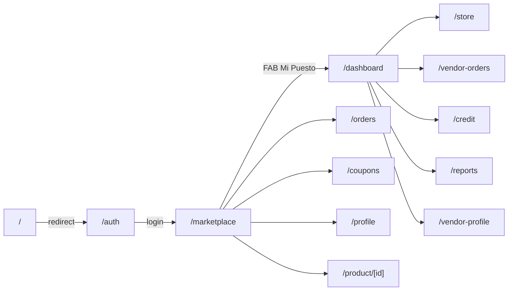

# FeriApp - Architecture

> Marketplace digital para ferias libres de Chile. Two roles: **customers** (browse/buy) and **vendors** (manage stall, products, orders, credit).

## Stack
- **Next.js 16** (App Router, Turbopack) + **React 19** + **TypeScript** (strict).
- **Tailwind CSS v4** (via `@tailwindcss/postcss`).
- **@tabler/icons-react** for icons.
- **motion** (v12) for animations (React components + vanilla `animate`/`inView`).
- **Biome** for lint/format.
- **No database** - all data lives in `src/data/mock-data.ts` (editable).

## Design system - "Soft Organic"
Defined as Tailwind theme tokens in `src/app/globals.css`:

| Token | Value | Usage |
|---|---|---|
| `--color-ghost-white` | `#F8F8FF` | App background |
| `--color-light-sea-green` | `#20B2AA` | Primary accent |
| `--color-light-sea-green-dark` | `#1CA098` | Hover states |
| `--color-oxford-navy` | `#003262` | Text / dark surfaces |
| `--color-hairline` | `#d0d0cc` | Borders |

- Fonts: **Outfit** (`--font-outfit`, headings) + **Nunito Sans** (`--font-nunito`, body) via `next/font/google`.
- Reusable CSS classes: `.bento-card`, `.custom-shadow`, `.soft-pill-shadow`, `.input-focus-effect`, `.no-scrollbar`.
- Mobile-first, each screen constrained to `max-w-[375px]`.

## Project structure

```
src/
  app/
    layout.tsx              Root layout: fonts + theme
    globals.css             Design tokens + base styles
    page.tsx                Redirects "/" -> "/auth"
    auth/page.tsx           Login / Register (entry point)
    (customer)/             Customer route group + bottom nav
      layout.tsx
      marketplace/page.tsx  Browse products (home)
      orders/page.tsx       Customer orders + filters
      coupons/page.tsx      Coupons (copy code, used state)
      profile/page.tsx      Customer profile
      product/[id]/page.tsx Product detail + qty selector
    (vendor)/               Vendor route group + bottom nav
      layout.tsx
      dashboard/page.tsx    Vendor home (credit, debt, mgmt)
      store/page.tsx        Manage products (add/remove/toggle)
      vendor-orders/page.tsx Order status workflow
      credit/page.tsx       Request/pay credit + history
      reports/page.tsx      Sales bar chart + top products
      vendor-profile/page.tsx
  components/
    customer/CustomerBottomNav.tsx
    vendor/VendorBottomNav.tsx
    ProductCard.tsx         List item w/ add-to-cart counter
    OrderCard.tsx           Reusable order display
    StatusBadge.tsx         Order status pill
    PageHeader.tsx          Back button + title header
    Reveal.tsx              Motion entrance wrapper
    icons.ts                Category icon name -> component map
  data/
    mock-data.ts            ALL test data + types + selectors
  lib/
    format.ts               CLP currency + date + initials helpers
```

## Routing & navigation



Two route groups share layouts with role-specific bottom navigation:
- `(customer)` - Inicio / Pedidos / FAB(Mi Puesto) / Cupones / Perfil.
- `(vendor)` - Inicio / Pedidos / FAB(Tienda) / Credito / Perfil.

## Data layer (mock)
Single editable file `src/data/mock-data.ts` exports typed arrays + selectors:
- `categories`, `products`, `vendors`, `customerOrders`, `vendorOrders`, `coupons`, `creditInfo`, `salesData`, `topProducts`, `currentUser`.
- Selectors: `getProductById`, `getVendorById`, `getCategoryById`, `getProductsByCategory`, `getFeaturedProducts`, `getVendorProducts`, `pendingVendorOrderCount`.
- Formatting helpers in `src/lib/format.ts`: `formatCLP`, `formatDate`, `initials`.

Stateful pages (store, vendor-orders, credit) keep local React state seeded from mock data so user edits (add product, advance order, pay debt) work in-session.

## API
No backend / API routes yet. Authentication is mocked: the auth form has a **role selector** (Cliente / Feriante) that sets a client-side role (see below) and decides the post-login redirect - `cliente` -> `/marketplace`, `feriante` -> `/dashboard` - so both perspectives can be demoed. Logout returns to `/auth`.

## Role state & navigation
A `RoleProvider` (React Context, `src/components/RoleProvider.tsx`) wraps the app in the root layout and persists the selected role (`cliente` | `feriante`) to `localStorage`. Both bottom navs consume it via `useRole()`:

- **Cliente** - `CustomerBottomNav` shows 4 items only (Inicio / Pedidos / Cupones / Perfil). The "Mi Puesto" FAB is **hidden**; clients never reach vendor management pages.
- **Feriante** - on vendor pages, `VendorBottomNav` shows Inicio / Pedidos / FAB **"Mercado" -> `/marketplace`** / Credito / Perfil. Store management is reached from the dashboard ("Editar Productos"). When a feriante browses the marketplace, the `CustomerBottomNav` renders the "Mi Puesto" FAB -> `/dashboard` so they can return to seller mode.

This keeps each role's navigation focused and lets a feriante both sell and buy.

## Responsive strategy
The app is **always** a fixed mobile viewport of **430x932**, wrapped in an aesthetic phone frame (`src/components/PhoneFrame.tsx`) rendered by the root layout:
- Outer wrapper centers the device on a slate gradient backdrop (scrollable if the viewport is shorter than 932px).
- Bezel: dark rounded frame with decorative side buttons (volume/power).
- Screen: a 430x932 rounded container with a **dynamic island** and a **status bar** (9:41, cellular/wifi/battery) occupying the top 44px.
- A single internal **scroll area** (`absolute top-44px bottom-0 overflow-y-auto no-scrollbar`) holds all page content, so scrolling happens inside the phone, not the browser.
- A `#phone-portal` div (absolute inset-0 over the screen) is the portal target for modals/bottom sheets so they overlay the whole device instead of escaping to the browser viewport.

All previously `fixed` navigation was converted to `sticky` so it pins within the phone's scroll area:
- `CustomerBottomNav` / `VendorBottomNav` -> `sticky bottom-0` (last child of a flex-col layout).
- Marketplace `TopNav` -> `sticky top-0`.
- Store/Credit modals -> reusable `BottomSheet` component using `createPortal` into `#phone-portal` (`absolute inset-0`).

Route group layouts use `flex min-h-full flex-col` with page content in a `flex-1` div; the `max-w-[375px]` constraint and `sm` borders/shadows were removed (the phone frame replaces that containment).
